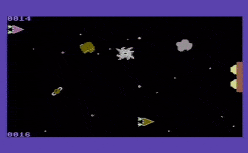
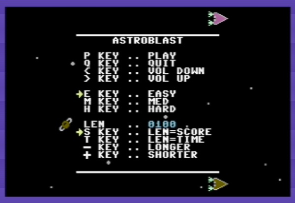

# astroblast 
Code to test the nv_sprite.asm library

## Overview
All the assembler code in this directory is written for Kick Assembler and in general the setup outlined in the [main repository README.md](../README.md).
This program is a mini C64 game that uses the nv_c64_util code for various functionality.  When the game is running it looks something like this

## Building
To build the program open the astroblast directory in VS Code and then open the file astroblast.asm.  With the kick assemebler IDE Extension installed per the [main repository README.md](../README.md) in the root directory of this repository you press F6 and the Extension will call kickassembler appropriately for all the files needed and produce astroblast.prg which is a C64 program file that can be loaded an run on a real Commodore 64 or in the VICE C64 emulator.

## Game Play
This is a two player game.  There is no one player mode.  The object of the game is to collect more asteroids than the other player before the time runs out or the target number of asteroids has been collected.  Both options of playing for a duration vs number of asteroids and the game ending number of seconds or asteroids collected can be set in the opening title screen

To play this game both joysticks are used.  Joystick 1 controls the ship on the top of the screen as it moves left to right and joystick 2 controls the bottom ship.  Both ships are always moving forward unless pushed back by some solar wind in the game.  Players control the speed at which the ships move though.  

There is a Turret on the far right of the screen halfway down.  This turret has two guns, one shoots up and the other shoots down.  The turret can only shoot while its armed.  Players can see that the turret is armed and about to shoot because the guns will be flashing yellow and white.  While the turret is armed either player can force it to fire by pressing the joystick fire button and only the gun pointed at the other player will shoot. If neither player fires while the turret is armed, it will eventually fire at both ships on its own.   If a turret shoots a ship, that ship is stunned which turns it grey, and its pushed back to the far left until it can recover.  While a ship is stunned it can not collect asteroids or be controled by the players joystick.

## Game Points of Interest
Some interesting points regarding the way the game is put together follow.
### Game Sound
The game sounds were created using GoatTracker v2.76.  The main music for the game is in the file **astro_sound.sng**. When loaded into GoatTracker you will see that there are a few different subtunes that are used in the game including: 
 - Subtune 0: The main music that plays throughout most of the game
 - Subtune 1: The music that plays during the winner screen once the game is over.
The sound effects for the game are individual instruments created in GoatTracker.  These files are loaded and edited separately in GoatTracker.  Here are some of the sound effect files in the game:
 - hole_sound.ins: The sound played when the blackhole appears in the game
 - ship_hit_asteroid_sound_fx.ins: The sound played when a ship hits an asteroid
 - silent_sound_fx.ins: a very short sound that is silence.  This is only use as a way to interupt other effects that are playing.
 - turret_fire_sound_fx.ins: is the sound that is played when the turret fires.

#### astro_sound.bin
Neither the .sng file nor the .ins files can be used directly within the game.  The must be converted to binary files first.  To convert the **astro_sound.sng** file to **astro_sound.bin** follow the following steps:
1. Start GoatTracker with this command `goattrk2.exe -N`  the -N is for NTSC mode rather than PAL
2. Load the astro_sound.sng file using the F10 key.  Note: you must have the cursor in the left pattern editing side of the program to load a .sng file.  If the cursor is in the right instrument side of the program then it assumes you want to load an instrument (.ins) file.  As an aside, once loaded, this file can be edited and then saved.  To save it as a .sng file, use the F11 key and give it the name you want to save as.
4. 
