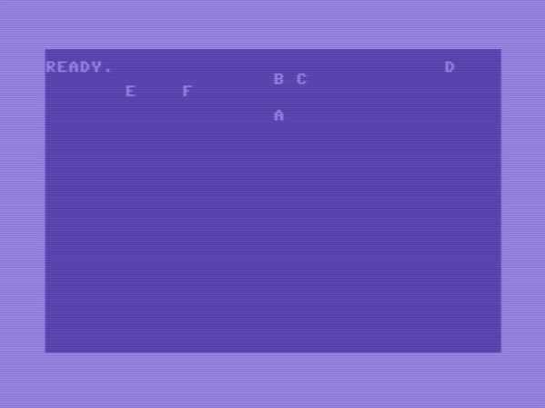

# Parameter Passing Strategies
This directory contains examples of several parameter passing strategies for 6502 assembler programmging.  

This is a topic becase JSR puts the return address (minus 1) on to the stack before setting the program counter to the called routine, so any parameters that are pushed on to the stack before JSR need to consider this because when RTS is called it expects the return address (minus 1) to be at the top of the stack.

## Overview
All the assembler code in this directory is written for Kick Assembler and in general the setup outlined in the [main repository README.md](../README.md)

## Strategies Considered
The parameters.asm file includes multiple subroutines that all do the same thing which is print a single character at an x and y location on the screen.  Each subroutine uses a different method to pass get the 3 required pieces of information to the routine.
1. The x location (row) at which the char will appear (only 0-5)
2. The y location (col) at which the char will appear (0-39) 
3. The character to print on the screen

This multiple subroutines include one for each of the following methods to get their parameters:
- Registers Only:                   All parameters passed in registers
- Function defined parameter block: Single global parameter block for function params
- Code Modification:                Caller modifies subroutine code (yes self modifying code)
- Caller defined parameter block:   Caller defines the param block for the call and passes address of it in regs
- Routine stack perserving:         Caller pushes params onto the stack routines preserves stack
- Routine JMP back:                 Caller pushes params onto the stack, routine pops params and jumps back (no rts)

## Main program
The main program calls each of the routines described above and passes a different character and (x, y) location.  When the program is executed the output looks like this:

