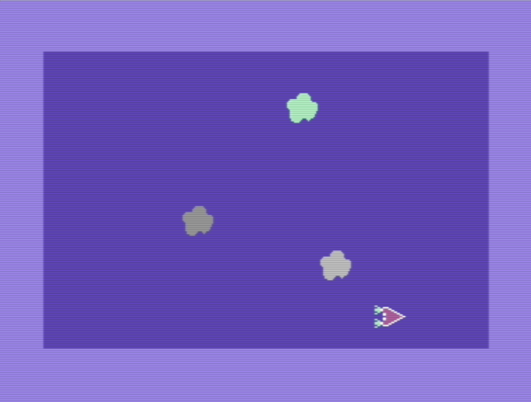

# sprite_test 
Code to test the nv_sprite.asm library

## Overview
All the assembler code in this directory is written for Kick Assembler and in general the setup outlined in the [main repository README.md](../README.md).
This program is being used as a test driver for the nv_c64_util code around sprites (nv_sprite.asm).  It will be updated to test new features as they are added to nv_c64_util.  It loads some sprites and moves them all around the screen in a way that is reminiscent of Asteroids, but its not a full game, its just displaying sprites with some movement and velocity.  When its running it looks like this: 

