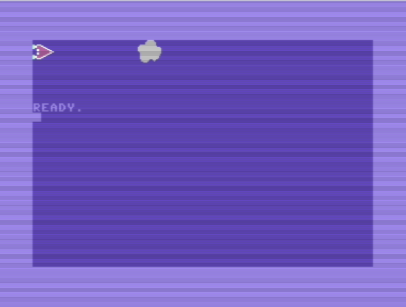
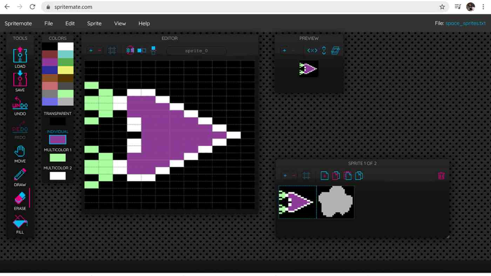

# sprites_display project

## Overview
Sample assembly language program that demonstates how to display a hardware sprite on a Commodore 64.  This program will display a spaceship and and astroid sprite.  The sprites don't move, but you can look for another project in this repository to see how to move them.  

When you run it you'll see a screen like this:

## Setup
- VS Code, Kick Assembler, VICE as outlined in [main repository README.md](../README.md)
- To create the ship and astroid sprites the online spritemate web based tool was used: [http://spritemate.com](http://spritemate.com)

## File Descriptions
- **spritedisplay.asm:** The main (only) source code file for the project.
- **clean.bat:** A batch file to clean up the files created by assembler and VS Code
- **space_sprites.spm:** The spritemate file saved in its native format
- **space_sprites.txt:** The spritemate file saved as assembly code for Kick Assembler

## Description
To create this project first step was to create two sprites
- ship sprite (multi color/lo res)
- astroid sprite (hi res/single color)
To do this you can point a web browser at spritemate.com and work on your sprites right in your browser.  This is what the UI looks like:

Note that multiple sprites can be saved at once.

Other resources to check out regarding C64 sprites:
- https://www.c64-wiki.com/wiki/Sprite
- PETSCII Editor: http://petscii.krissz.hu/

